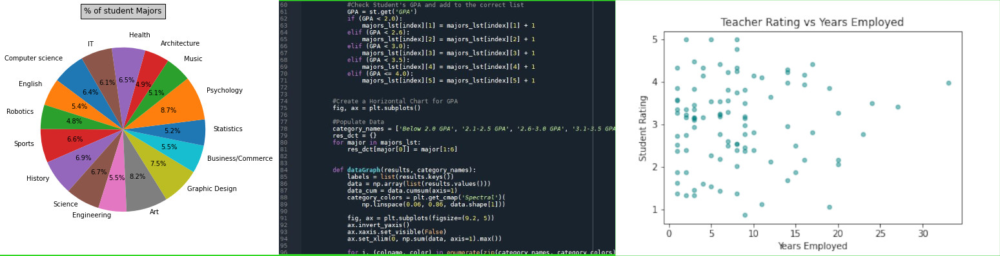

<title>John Shumway's Homepage</title>

## Welcome to my local project page!
### About Me:

I am an experienced software developer who has worked with various data-based programs and tools. I've studied computer science and software development for 8 years, and worked in the development industry for 5 years.  I am proficient in .Net, JAVA, Batch/Powershell and Python coding. I also have experience with Databases such as MS SQL, MySQL and SQLite in both Windows and Linux OS.  While I have an all-around knowledge of software development to handle any kind of task, I have been focusing on data analytics and data science and plan to specialize into that field.

### Project: DataSci Python
The DataSci Python Project is the capstone project built during the SNHU Computer Science program. In 6 weeks, I built a Python data mining program and a simple database from scratch. For this project, I used a sample school data showing student's GPA and teacher pay information. The data mining program uses 'modules' that I built to generate different graphs that show bar charts, Pie charts, and scatterplots. This module system can be improved upon to easily add in new data function for more complicated data mining.

[DataSci](https://github.com/JSdata91/JSdata91.github.io/tree/main/DataSci/src) 

[Documents](https://github.com/JSdata91/JSdata91.github.io/tree/main/Documents) 

### Contact

You can reach out to me at jshumway2011@gmail.com
